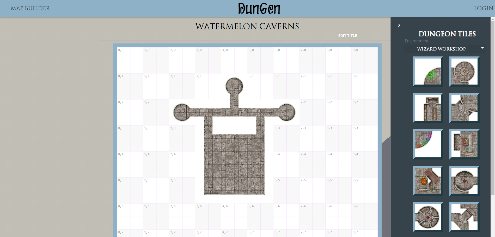

# DunGen: Dungeon Map Builder
[](https://opensource.org/licenses/MIT)


## Description
So you have an hour left before you're game, and you forgot to create a map for your player's to explore! Or perhaps you find yourself needing a map mid-game and you need a map STAT -- you don't have time for something real fancy, and just need to throw something together during a short interlude.

DunGen is our answer to your needs, providing you with a simple and intuitive drag-and-drop map building experience on the web. With tilesets provided by [Skeleton Key Games](https://www.skeletonkeygames.com/) and easy tile controls, build out a map quickly and easily. Once you're done, render the tiles into a single image that you can use however you like. Import it into your favorite game management app, print it out, or order a high resolution version printed on neoprene or vinyl*.

## Table of Contents
* [Installation](#Installation)
* [Usage](#Usage)
* [Contributing](#Contributing)
* [Tests](#Tests)
* [Questions](#Questions)
* [License](#License)

screenshot.png


## Installing
Feel free to clone or fork the repo to load it locally, and update the database information.
- make sure you have both the front-end and back-end repos!
- ```npm install``` to install the required packages
- ```npm start``` or ```nodemon server.js``` in the back-end repo
- ```npm start``` in the front-end repo

## Usage
Once the app is running locally (or if you just visit our site!), simply login and click Map Builder! Open up the tileset "drawer" on the right and start dragging tiles onto the grid. Double click a tile to rotate, mirror, or delete the tile. The map is saved in your browser so if you refresh the page you won't lose your hard work. Click the save button to permanently save the map to the database. Your saved maps can be found on the Saved Map page (your "dashboard") where you can open the map for editing, view the rendered map, or delete it.

### Contributing
Please get in touch with one of us before pushing any code. You are of course welcome to fork a copy and do what you like with your copy!

### Tests
none included

### Questions
- Find us on Github: [Daniel](https://github.com/desasser), [Doug](https://github.com/DougJohnson22), [Calvin](https://github.com/Calmanning), [Angel](https://github.com/skelliebunnie)

### License
Copyright (C) 2021 Daniel, Doug, Calvin, Angel

https://opensource.org/licenses/MIT

Permission is hereby granted, free of charge, to any person obtaining a copy of this software and associated documentation files (the "Software"), to deal in the Software without restriction, including without limitation the rights to use, copy, modify, merge, publish, distribute, sublicense, and/or sell copies of the Software, and to permit persons to whom the Software is furnished to do so, subject to the following conditions:

The above copyright notice and this permission notice shall be included in all copies or substantial portions of the Software.

THE SOFTWARE IS PROVIDED "AS IS", WITHOUT WARRANTY OF ANY KIND, EXPRESS OR IMPLIED, INCLUDING BUT NOT LIMITED TO THE WARRANTIES OF MERCHANTABILITY, FITNESS FOR A PARTICULAR PURPOSE AND NONINFRINGEMENT. IN NO EVENT SHALL THE AUTHORS OR COPYRIGHT HOLDERS BE LIABLE FOR ANY CLAIM, DAMAGES OR OTHER LIABILITY, WHETHER IN AN ACTION OF CONTRACT, TORT OR OTHERWISE, ARISING FROM, OUT OF OR IN CONNECTION WITH THE SOFTWARE OR THE USE OR OTHER DEALINGS IN THE SOFTWARE.